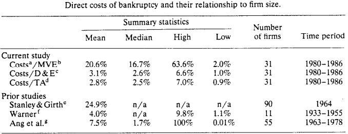
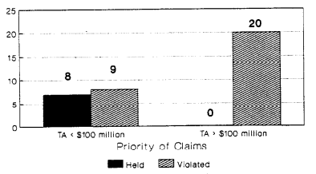
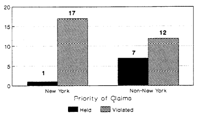

```{r setup, include=FALSE}
options(htmltools.dir.version = FALSE)
knitr::opts_chunk$set(
  fig.width=9, fig.height=3.5, fig.retina=3,
  out.width = "100%",
  cache = FALSE,
  echo = TRUE,
  message = FALSE, 
  warning = FALSE,
  hiline = TRUE
)
```

```{r xaringan-themer, include=FALSE, warning=FALSE}
library(xaringanthemer)
style_duo_accent(
  primary_color = "#A60F2D",
  secondary_color = "#4D4D4D",
  inverse_header_color = "#FFFFFF",
  # fonts
  header_font_google = google_font("Martel"),
  text_font_google = google_font("Lato"),
  code_font_google = google_font("Fira Mono")
)
```

```{r xaringan-panelset, echo=FALSE}
xaringanExtra::use_panelset()
```

```{r xaringan-scribble, echo=FALSE}
xaringanExtra::use_scribble()
```


# Agenda

### Motivation & Data

### Direct Costs of Bankruptcy

### Priority of Claims

> ### Methodologies

### Conclusion

---

class: inverse center middle, hide-logo

# Motivation & Data

---

layout: true 

## Motivation & Data 

---

### Bankruptcy Reform Act of 1978 (The Code)

_The current Bankruptcy Code was enacted in 1978 and became effective on October 1, 1979._ 

- This current code completely replaced the former Bankruptcy Act of 1898

 - While the current code has been amended multiple times since 1978, but the core enactment is still used today

- Most notably, this iteration of the code developed Chapter 11
  
  - Prior codes accounted for 'general provisions', 'case administration', 'creditors and debtors', and 'liquidation'
  - Chapter 11 now allowed for 'reorganization'
  - In most instances, Chapter 11 bankruptcy filings leave the debtor in control of its business operations - with some oversight
    
- Chapter 11 Plan

 - 120 days to reorganize, a judge must approve (plausible without creditors)

---

### Data  

_Firms filing for bankruptcy from 1980 (44,000) jumped by 1986 (81,000)_

.pull-left[

37 New York Stock Exchanges (NYSE) and American Stock Exchange (AMEX) firms that filed petitions under the 1979 Code between October 1, November 1979 and December 31, 1986

  1. SEC's annual report to Congress (contains all presentations by the SEC to bankruptcy courts)
  1. The _Wall Street Journal Index_ listing of all firms that declare bankruptcy
  1. _Compustat's_ Research File listing all firms dropped because of bankruptcy files
  1. Firms listed as suspended or deleted from the Center for Research in Security Prices (CRSP) tapes
]

.pull-right[

Financial institutions are excluded because they are not subject to the standard provisions of the bankruptcy code.  Because court documents are available only at the federal court where the petition is filed, budget and time constraints, data collection was confined to the following seven jurisdictions: 

- Central District of California
- Southern District of Florida
- Northern District of Illinois
- District of Massachusetts
- Northern District of Michigan 
- Southern District of New York
- Northern District of Ohio

]
---

### Data

- Among these federal court locations, there were a total of 51 filings in the initial sample, but an additional 14 firms were excluded because:
  1. Their bankruptcies were not resolved by May 31, 1989
  1. Their data were being used by a bankruptcy judge and hence were not available for study
  1. Their data had been removed from the court to an archive
  
- The final sample contains 37 firms with substantially shorter bankruptcy petition to resolution timing (2.5 years on average) relative to prior studies (12.5 years, Warner - 1977) 

- These firms' ratio of debt to total assets is also 77%, 50% higher than the 51% listed on Compustat for all non-bankrupt firms

---

layout: false
class: center, hide-logo
background-image: url("img/tab1.png")
background-size: contain

---

layout: false

class: inverse center middle, hide-logo

# Direct Costs of Bankruptcy

---

layout: true 

## Direct Costs of Bankruptcy

---

### Direct vs Indirect Costs

.panelset[
.panel[.panel-name[Direct Costs]

The direct costs of bankruptcy are the legal and other professional and administrative fees associated with the bankruptcy filing; they represent the measurable part of all bankruptcy costs.  

Three measures are used to asses the magnitude of the direct costs of bankruptcy: 

1. Market value of equity
1. Book value of debt plus the market value of equity
1. Book value of total assets

- Market value of debt is not used because too few firms had any publicly traded debt 
- Book value of debt is readily available and is used as a proxy for the market value of equity
- The book value of total assets is used to ensure the results are not overstated by the large drop in market value of equity that occurs before the bankruptcy filing (Weiss, 1989)

]
.panel[.panel-name[Indirect Costs]

The indirect bankruptcy costs are the uneasurable opportunity costs, including: 

1. Lost sales and a decline in the value of inventory
1. Increased operating costs, loss of employees and suppliers
1. A reduction in the firm's competitiveness

]
.panel[.panel-name[Key Findings]

#### Direct Costs of Bankruptcy 
1. 20.6% of the market value of equity
1. 3.1 % of the book value of debt plus the market value of equity
1. 2.8% of the book value of total assets

#### In Contrast To
- 25% (Stanley and Girth, 1971) - total assets from financial statements
- 7.5% (Ang, Chua, and McConnell, 1982) - liquidated value of firms
- 4% (Warner, 1977) - mostly heavily regulated railroads included

]
.panel[.panel-name[Table 2]



]
]

---

layout: false

class: inverse center middle, hide-logo

# Priority of Claims

---

layout: true 

## Priority of Claims

---

### The New Code and Priority of Claims

#### Chapter 7 Bankruptcy 

- Provides for orderly liquidation of a firm's assets by a court-appointed trustee, and payment to claimants in order of priority is always maintained (_2/37 Firms_)

#### Chapter 11 Bankruptcy

- Provides for reorganization of a firm, filing must approve a plan of reorganization, allow negotiations among parties and for violation of claims (_35/37_ Firms)  

.pull-left[

**"Cram Down"** - If the bankruptcy judge does not believe agreement will be reached, he or she can for acceptance of a plan (negotiation) by using a procedure called a 'cram down'

]
.pull-right[

_Important to note: Secured creditors may also be willing to violate priority to reduce the risk of decay in the value of their collateral_

]
---

### Methodology

#### This study uses the figures reported in the reorganization plan confirmed by the bankruptcy court(s).

The Plan: 

- Designates each class of creditors, treatment, and adequate means of implementation
- _Says whether a given class will receive at least as much as it would receive in a liquidation_
- Indicates whether priority of claims is violated when agreement among the parties is reached

The values in any plan are confirmed by an "impartial judge," but have limitations:
1. The amount of a creditor's claim is the amount allowed by the court, and the court accepts management valuations
1. The court may understate the amount of the claim by failing to provide incorporate interest
1. The court will accept management's view of whether creditors are impaired, and creditors may decide it is not worth the effort and expense to prove otherwise

---

### Deviations and Violations  of Strict Priority of Claims

.panelset[
.panel[.panel-name[Leniency]

_Discussions with lawyers by Weiss indicated that two factors, firm size and locations of bankruptcy, are important in predicting whether priority of claims will be violated._

- Larger, more complicated bankruptcies present more opportunities for equity holders and small groups of unsecured creditors to gain concessions from other creditors.

> "A February 6, 1989 _Miami Review_ article describes how the Southern Disctrict of Florida's chief bankruptcy judge is much tougher on debtors than judges in some other districts."

- Corporations with assets and operations in several jurisdictions have some latitude in deciding where to file.

]
.panel[.panel-name[Total Assets]
.pull-left[

#### Bankruptcy Resolutions by Size


]

.pull-right[

- Strict priority is violated for all 20 firms having total assets over $100 million

- For firms with less than $100 million in assets, strict priority holds in eight of 17 cases, only one of which was in New York

- There appears to be a strong link betweekn firm size and priority of claims

]
]
.panel[.panel-name[Filing Location]

.pull-left[

#### Bankruptcy Resolutions by Location


]
.pull-right[

- "Lawyers in both Florida and Illinois assert that judges and lawyers in their jurisdictions are more willing to freeze out equity holders than are judges and lawyers in New York." 
- Lawyers in New York say there is less fighting among parties in New York because of the greater sophistication of the creditors and a willingness by creditors to compromise priority to settle the case quickly
- All cases in the Southern District of New York were handled by just five judges, of whom the Honorable Burtan R. Lifland handled over 33% of the cases

]
]
]

---

layout: false
class: center, hide-logo
background-image: url("img/tab3.png")
background-size: contain

---

layout: false

class: inverse center middle, hide-logo

# Conclusion

---

## Conclusion

> "Olson (1965) declares that 'unless the number of individuals in a group is quite small, or unless there is coercion or some other special device to make individuals act in their common interest, rational, self-interested individuals will not act to achieve their common or group interest'." 

_Bankruptcy should resolve this human error by (1) preserving the value of the firm and preventing premature liquidation, and (2) enforcing creditors' rights.  **Perhaps it is a lack of belief in markets that may underpin the reasons the law perceives it necessary to allow violation of priority of claims.**_

.pull-left[

### Direct Costs

_ If either the direct costs of resolving a bankruptcy are high or creditors cannot be confident that priority of claims will be honored, creditors will require somewhat higher interest rates._

On average, direct costs of bankruptcy are 3.1% of the book value of debt plus the market value of equity.

]

.pull-right[

### Priority of Claims

- Priority of Claims is violated in 29 of 37 cases examined
- Unsecured creditors are frequently denied priority over both equity holders and lower-ranked unsecured creditors
- Secured creditors receive their full claim in all but 3 of the 37 cases
]

