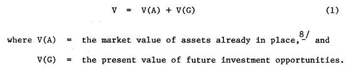
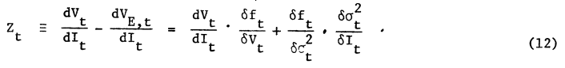

```{r setup, include=FALSE}
options(htmltools.dir.version = FALSE)
knitr::opts_chunk$set(
  fig.width=9, fig.height=3.5, fig.retina=3,
  out.width = "100%",
  cache = FALSE,
  echo = TRUE,
  message = FALSE, 
  warning = FALSE,
  hiline = TRUE
)
```

```{r xaringan-themer, include=FALSE, warning=FALSE}
library(xaringanthemer)
style_duo_accent(
  primary_color = "#A60F2D",
  secondary_color = "#4D4D4D",
  inverse_header_color = "#FFFFFF",
  # fonts
  header_font_google = google_font("Martel"),
  text_font_google = google_font("Lato"),
  code_font_google = google_font("Fira Mono")
)
```

```{r xaringan-panelset, echo=FALSE}
xaringanExtra::use_panelset()
```

```{r xaringan-scribble, echo=FALSE}
xaringanExtra::use_scribble()
```

## Agenda

### **Motivations**

### **The Basic Idea**

### **Further Discussion**

### **Abstract Generalizations**

### **Conclusions**

---

## Motivations

> There is an important gap in modern finance theory on the issue of corporate debt policy. **This theory should be able to explain why the tax advantages of debt financing do not lead firms to borrow as much as possible - while defining "as much as possible."**

--

_"This paper presents a new approach which does not rely on any of the ideas mentioned above (e.g., credit rationing, M&M, bankruptcy costs, etc.)."_

.center[**Ultimately, Myers leads to a theory under which it is rational for firms to limit borrowing, even when interest is tax-deductible and capital markets are strictly perfect and complete.**]

--

> The value of a firm (Myers) is accounted for by the present value of **options** to make further investments on possibly favorable terms - the value depends on exercising these options.  

>This paper shows that a firm with risky debt outstanding, and which acts in its stakeholders' interest, will follow a different decision rule than one which can issue risk-free debt or no debt at all.

.center[**Thus, the optimal strategy involves a tradeoff between the tax advantages of debt and the costs of the suboptimal future investment strategy.**]

---

## The Basic Idea

.panelset[
.panel[.panel-name[Statement of the Problem]

_There is a distinct difference in modern finance theory that considers ratios based on market values much more pertinent than book values.  **That being said, book values simply refer to assets already in place**._

Assume no corporate taxes and no bankruptcy costs, let _V_ = current equilibrium market value of the firm

.center[]

- It is important to note that positive _V(G)_ is not jut excess return over the cost of capital - rather, it is "best regarded as the present value of the firm's _options_ to make future investments" 
- This is the difference between assets whose **ultimate value depends on further, discretionary investment by the firm, and those assets whose ultimate value does not**

]
.panel[.panel-name[Figures 1 & 2]

.pull-left[


]
.pull-right[


]
]

.panel[.panel-name[Borrowing and Market Value]

> Since the firm will be worth nothing in states s < s(a), it can issue no safe debt.  **However, it can issue risky debt with the promised payment _P_.**

The equilibrium market value, 

.center[]

- Then if V(s) - I >= P, the stockholders' interest is to pay the debtors off

- If V(s) - I < P, however, the bondholders will take over, _and will exercise the firm's option to invest if V(s) >= I_

]

.panel[.panel-name[Figure 3]
.pull-left[

]
.pull-right[

**The first rationale for credit rationing that does not depend on market imperfections:**

- V(D) < V, except in the limit where P approaches infinity


- The creditors will receive nothing at all if s < s(b) 

- Here, **V is a monotonically decreasing function of P**, and it is maximized when P and V(D) equal zero

]
]

.panel[.panel-name[Taxes]

> There must be some other factor to explain why firms issue risky debt.  The obvious candidate? - corporate income tax.

_Suppose the firm can deduct the full amount of P - V(D) in all states, and the tax rate is T, the value of the firm is:_

.center[]

- Equation 9 utilizes a minimization with respect to interest rate _R_ to avoid any arbitrarily large V following an equally large P

]

.panel[.panel-name[Figure 4]

.center[]

]
]

---

## Further Discussion

.panelset[
.panel[.panel-name[Assets as Call Options]

> What are the essential characteristics of the "growth opportunity" already mentioned?  **They flow from the fact that it can be regarded as a call option on a real asset.**

- The option's exercise price is the future investment needed to acquire the asset
- Whether the option has any value when it expires depends on the asset's future value
- It also depends on whether the firm chooses to exercise 

This decision to exercise is not trivial or automatic, as it is for options written on securities, **since it depends on the magnitude of promised payments to bondholders**

_The most fundamental distinction is not between 'growth opportunities' and 'assets in place,' but:_ 

.pull-left[
(1) Assets that can be regarded as call options, in the sense that their ultimate values depend on further discretionary investment by the firm.
]
.pull-right[
(2) Assets whose ultimate value does not depend on further discretionary investment.
]
]

.panel[.panel-name[The Debt Contract]

#### A Potential Solution

> Why not eliminate this problem (firm actions in various circumstances) by adding a clause to the debt contract?  The contract would be rewritten to require the firm to take on each investment project in all states where its net present value is positive.

#### This is Practically Impossible

1. **Such a contract is not enforceable when it counts**, since limited liability protect shareholders from mandatory future assessments
1. Even if such a contract is laboriously constructed, **there will rarely be any objective basis for judging whether it is breached**

]

.panel[.panel-name[Restrictions on Dividends]

> Restricting dividend payments can protect against the suboptimal investment decisions induced by risky debt.

_"I regard this as a strong rationale for restrictive covenants on dividends, and a partial solution to the warped investment incentives created by risky debt. The reasons it is only a partial solution include the following:"_

1. **There are still monitoring costs**, since there are so many possible channels for transferring capital to the firm's owners.

1. **The investment incentives are still not exactly right.**  Shareholders' viewpoint is not the one which maximizes the market value of the firm.

1. The dividend restriction may force the firm to **invest in assets with negative net present values.**

1. A dividend constraint is helpful **only when cash is actually available for payout**, otherwise it is irrelevant.  

]

]
---

## Abstract Generalizations

> Because the value of the firm depends on its future investment strategy, it is useful to think of the firm as composed of two distinct asset types: (1) _real assets_, and (2) _real options_.

.pull-left[


]
.pull-right[

**At any point in time the value of oustanding bonds is related to the value of the firm and on the uncertainty about the firm's future value.**



- In other words, there is a transfer of value from stockholders to bondholders, called _Z_
- Equation (12) assumes a continuous investment schedule rather than discrete projects.  The discrete case is shown in Figure 5 **where the shaded area indicates the loss of net present value**

]
---

## Conclusions

.center[]

1. **Assets-in-place should be financed with more debt than growth opportunities.**  The investment in assets-in-place is a sunk cost and, by definition, not discretionary.
1. **For assets-in-place, the following should be associated with heavy debt financing:** (a) capital-intensity and _high_ operating costs, (b) profitability, ideally measured by future value.

--

_Suppose that real options are riskier than assets just as stock options are almost always riskier than the stocks they are written on:_ 
1. Neo-classical valuation models **(M&M) are mis-specified.**
1. One cannot measure the equilibrium capitalization rate for a firm's stock and then use it as a hurdle rate for capital budgeting **(this will overestimate growth opportunities).**
