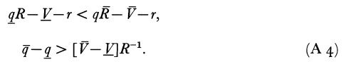
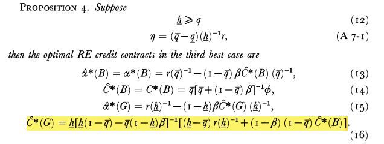

```{r setup, include=FALSE}
options(htmltools.dir.version = FALSE)
knitr::opts_chunk$set(
  fig.width=9, fig.height=3.5, fig.retina=3,
  out.width = "100%",
  cache = FALSE,
  echo = TRUE,
  message = FALSE, 
  warning = FALSE,
  hiline = TRUE
)
```

```{r xaringan-themer, include=FALSE, warning=FALSE}
library(xaringanthemer)
style_duo_accent(
  primary_color = "#A60F2D",
  secondary_color = "#4D4D4D",
  inverse_header_color = "#FFFFFF",
  # fonts
  header_font_google = google_font("Martel"),
  text_font_google = google_font("Lato"),
  code_font_google = google_font("Fira Mono")
)
```

```{r xaringan-panelset, echo=FALSE}
xaringanExtra::use_panelset()
```

```{r xaringan-scribble, echo=FALSE}
xaringanExtra::use_scribble()
```

## Agenda

### **Motivation & Objectives**

### **The Model**

### **Considering Moral Hazard**

### **Policy Implications**

### **Conclusion**

---

class: inverse center middle, hide-logo

layout: false

# Motivation & Objectives

---

## Motivation

> "Debt contracts often require borrowers to pledge collateral.  Merris (1979) reports that a Federal Reserve survey involving 340 banks found that approximately 40% of all short-term, and 60% of all commercial loans were _secured_ between 1977 and 1979.  **Despite this, the research on collateral is limited.**"

> "We develop a model in which banks compete for borrowers and deposits are elastically supplied."

### **3 Main Questions**

1. Under what conditions is there a positive association between borrower risk and collateral, as documented empirically by Orgler (1970)?

1. What is the economic role of collateral under private information and moral hazard?

1. How does monetary policy affect the cross-sectional dispersion of unsecured and secured lending?

---

class: inverse center middle, hide-logo

layout: false

# The Model

---

layout: true

## The Model

---

### Setup 

> "We assume universal risk neutrality and view banks as competing for both loans and deposits in a perfectly competitive credit market.  **Deposits are elastically supplied at the riskless rate.**"

#### Ergo,
1. Depositors receive an expected return equal to the riskless rate
1. Borrowers expected utilities are maximized subject to informational and breakeven constraints
1. Banks earn zero expected profits

_In this economy, there are two points in time, **t = 0 and t = 1**, the initial point and terminal point, respectively._  

**The borrower may be defined within _A_, such that**

.pull-left[

]
.pull-right[

]

---

### Setup

**Given the assumptions already made, we can understand that:**


Condition (A1) implies that the good borrower has a higher success probability than the bad borrower for any given action.  **This in turn implies that the _maximum_ possible improvement in the success probability for the good borrower is _smaller_ than that for the bad borrower.**  
- This implication assumes that the marginal impact of action on a borrower's success probability is _decreasing_ in borrower quality:

.pull-left[

]
.pull-right[

]

---

### The First Best Solution

> The first best equilibrium includes no moral hazard, and no private information. 

When both _a_ and _theta_ are observable to the lender, a borrower would solve below, where r is one plus the riskless interest rate.  The borrower chooses to maximize the value of its project net of the $1 investment for one period at _r_ :


Below, **_a lower-bar_ is optimal for the good borrower if (A3) conditions are met.**  Conversely, **_a upper_bar_ is optimal for the bad borrower if (A4) conditions are met.**  These conditions are compatible with (A1) and (A2).

.pull-left[

]
.pull-left[

]

---

class: inverse center middle, hide-logo

layout: false

# Considering Moral Hazard

---

## Considering Moral Hazard

.panelset[
.panel[.panel-name[Second Best Equilibrium]

> Suppose a borrower chose _a upper-bar_ in the first best case (the borrower is of the bad type).  **Then moral hazard is present if such a borrower chooses _a lower-bar_ in the second best case when offered an unsecured loan **(bank would make zero expected profit if borrower would have chosen _a upper-bar_).

.center[]

**Alpha and C are stated functions of the borrower's observable type, thus:** 
1. Each borrower's expected utility is maximized
1. Subject to the bank at least breaking even
1. The borrower choosing an incentive compatible action, a*

]
.panel[.panel-name[Prop 1]

.pull-left[


]
.pull-right[

- This proposition says that the bad borrower can be motivated to choose its first best action _a upper-bar_ **by offering it an appropriately designed secured loan**
- The reason why collateral has this effect is that the borrower loses collateral only upon default, **and the probability of default can be reduced by choosing a higher action**
- The good borrower gets an unsecured loan here since this is not efficient to motivate it to work harder, **_a lower-bar_ is its first best choice**

]

]
.panel[.panel-name[Prop 2]

.center[]

> Proposition 2 just tells us that if equation (7) holds, then the bad borrower (granted a secured loan) is riskier than the good borrower (granted an unsecured loan) using both risk measures.

**Orgler (1970) found empirically that bank examiners classified secured loans as riskier.**

]
.panel[.panel-name[Prop 3]

1. As the bank's marginal cost of funds rises, it must demand higher loan interest factors from both borrowers in order to continue to break even.  **"An increase in the riskless rate increases the loan interest factor of the good borrower and... that of the bad borrower."**

1. **"A reduction in the dissipative cost of collateral (Beta) reduces the collateral requirement for the bad borrower."**  A lowering of this cost implies that collateral is now worth more to the bank and less of it is needed to enable the bank to break even.

1. **"An increase in R reduces the bad borrower's collateral requirement and increases its interest factor - the good borrower is unaffected."** The reason for this, for a _given_ interest factor, an increase in R increases the borrower's net marginal return to effort.  

]
.panel[.panel-name[Third Best Equilibrium]

.pull-left[


]
.pull-right[

- **The only difference between this and the Second Best Equilibrium is the addition of the (global) truth-telling constraint (11)**
- The solution to (8)-(11) depends on the constellation of exogenous parameter values - the authors focus on parameter values for which moral hazard is not severe (A7)
- Eta is a strictly positive scaler
- From (A4) and (A5), it is implied that moral hazard is more severe for smaller values in the set.  **If eta is sufficiently large, moral hazard is moderate.**

]
]
.panel[.panel-name[Prop 4]

.center[]

- This case holds for a situation in which **moral hazard is moderate** (A7-1)
- Between here and Proposition 1, only the specification of **the contract for the good borrower has changed**
- The good borrower's contract now involves collateral because otherwise the bad borrower would covet this contract - **the presence of private information leads to a higher use of collateral in equilibrium contracts, and and introduction of collateral in all equilibrium contracts**

]
]

---


class: inverse center middle, hide-logo

layout: false

# Policy Implications

---

layout: true

## Policy Implications

---

### Testable Predictions

1. Despite deadweight costs associated with collateral, we should expect it to be widely used to cope with moral hazard and private information problems.
1. An increase in the (real) riskless interest rate increases collateral levels in secured loans, in both the second and third best equilibria. 
1. An increase in the (real) riskless rate increases interest on all loans, in both the second and third best equilibria.
1. A reduction in the dissipative cost of collateral reduces the level of collateral used in the second best equilibrium.
1. An increase in the loan size decreases the amount of collateral used in the second best equilibrium.

> Emperical data (1,4, and 5) comes from the "Federal Reserve's Survey of Terms of Bank Lending".  
**Over the sample period, 57.5% of the loans are secured (support of prediction 1).**
Additionally, interest rates have risen over the sample period, generally in line with collateral use.  **Implied by prediction 4, less collateral should be encountered with longer maturity loans (higher Beta).**  From the regression, _LNSIZE_ has a significant and negative coefficient  - **as the size of the loan increases, the likelihood it will be secured goes down (prediction 5).**  Similarly, _LNDUR_ has a significant and negative coefficient - **consistent with prediction 4.**

---

.center[]

---

class: inverse center middle, hide-logo

layout: false

# Conclusions

---

## Conclusions

> "Because private information may either accentuate or retard the positive relationship between collateral requirements and borrower risk encountered with just moral hazard, higher collateral may be posted by either safer or riskier borrowers.  **Moreover, borrower risk is endogenous and an outcome of the equilibrium.**"

- Higher interest rates in the economy lead to **both higher equilibrium loan interest rates and higher equilibrium collateral requirements**

- A decline in the dissipative costs of collateral or an increase in the loan size lead to **lower equilibrium collateral utilization**

- Over half of all loans in the authors sample period were secured, **with a temporal increase in secured lending**

- Larger loans and loans of longer maturity also have less collateral

